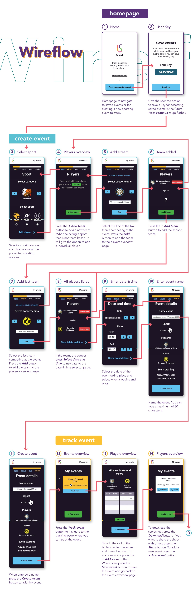

<p align="center">
  
</p>

<h1 align="center">Setrack</h1>
<p align="center">
  <b>Setrack</b> (Sporting event tracker) is an app where you can track a sporting event yourself, save it and/or share it.
</p>

<!-- 

**Setrack** (Sporting event tracker) is an app where you can track a sporting event yourself, save it and/or share it.  -->

## Contents

1. [**How to install**](#installation)
2. [**Concept**](#concept)
   * [**Wireflow**](#wireflow)
   * [**Layers**](#layers)
4. [**Features**](#features)
5. [**Browser compatibility**](#browser-compatibility)
6. [**Accessability**](#accessability)
7. [**License**](#license)

## How to install

To install the repository and run the app, follow these steps in your terminal:

1. Choose a directory and clone the repository:

```bash
git clone https://github.com/qiubee/setrack.git
```

2. Navigate to the cloned repository and install the [**dependencies**](package.json):

```bash
# Navigate to repository
cd setrack

# Install dependencies
npm install
```

3. Run the app either in development mode or normal mode:

```bash
# Normal mode
npm run start

# Development mode
npm run dev
```

## Concept

The app is made based on the 4th use case of the list of available [**Use cases**](https://github.com/cmda-minor-web/browser-technologies-1920/blob/master/Opdracht2.md#use-cases). The use case is described as follows:

> Ik wil de scores of tijden van een sportwedstrijd kunnen bijhouden tijdens de wedstrijd en opslaan en doorsturen.

Translated:

> *I want to be able to keep track of scores or times of a sporting event during the event, save it and share it.*

### Wireflow

Based on the use case I've made a wireflow of the app (see below). It shows how the app should work, which elements are interactive and where the user will navigate to or what the user will see when a button or link has been pressed.



### Layers

#### Functional

#### Reliable

#### Usable

#### Pleasurable

## Features

## Browser compatibility

## Accessability

I've taking into account the contrast-ratio of the colors, to be most accessible for those who are colorblind, by using the color contrast checker tool from [**WebAIM**](https://webaim.org/resources/contrastchecker/) and the built-in [**Accessability Inspector**](https://developer.mozilla.org/en-US/docs/Tools/Accessibility_inspector?utm_source=devtools&utm_medium=a11y-panel-description) in Firefox. These tools help to meet the [**WCAG AAA standards**](https://www.w3.org/TR/WCAG20/) for color contrast.

## License

[**MIT**](LICENSE)
